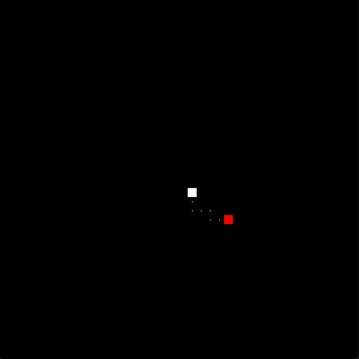

# 🐍 Ai playing Snake



Welcome to the Snake AI project! This application allows you to watch an artificial intelligence play the Snake game on its own.

## Instructions

To interact with the simulation, you can use the following keys:

- Press the **"A"** key to accelerate the simulation.
- Press the **"Z"** key to slow down the simulation.

## How It Works

The AI operates by utilizing the [A* algorithm](https://en.wikipedia.org/wiki/A*_search_algorithm) at each turn to determine the optimal path to the next apple. It evaluates the available options, such as avoiding obstacles and collecting apples, and chooses the most promising route. This ensures that the AI navigates the game board strategically.

One notable feature of the AI is its ability to wrap around the game board's edges. If the snake reaches the edge and goes off-screen, it reappears on the opposite side, creating a continuous play area. This feature enhances the snake's maneuverability and opens up new opportunities for collecting apples.

## Prerequisites

Before running the project, make sure you have the following dependencies installed:

- Python
- Necessary Python libraries (you can install them using `pip`):
  - [Pygame](https://www.pygame.org/)

## Running the Project

1. Clone this repository to your computer:

   ```bash
   git clone https://github.com/corederu/ai-playing-snake.git

2. run `main.py`

   ```bash
   python3 main.py
   ```
